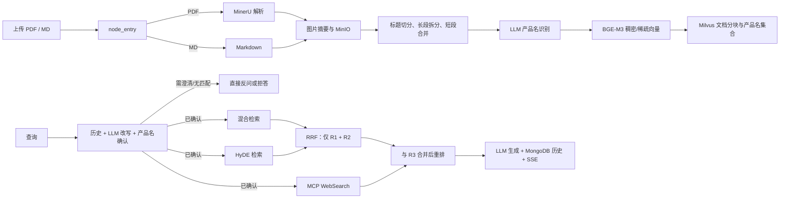

# RAG 项目能力审计

> 审计日期：2026-08-03  
> 审计方式：静态代码、配置和部署文件审阅；**未**使用真实模型、MinerU、Milvus、MongoDB、MinIO、Neo4j 或 MCP 进行端到端验证。  
> 状态说明：`✅` 已实现（代码中存在可调用的主路径）；`🟡` 已部分覆盖（存在实现但有明显边界、可靠性或生产化缺口）；`❌` 当前未发现实现；`—` 不适用于本项目或属于技术选型问题。  
> 说明：本文将题库中实现路径相同的问法合并为能力点，但覆盖了题库的全部主题；状态描述的是“当前仓库中能否找到实现”，不代表线上已验证有效。

## 1. 审计结论

项目已经具备一条完整的“文档入库 → 产品名约束 → 多路本地/外部召回 → 重排 → 生成 → 会话记录”的 RAG 骨架，适合继续向产品文档问答方向演进。

| 维度 | 结论 | 代表性证据 |
| --- | --- | --- |
| 离线入库 | `✅` | PDF/MD 分支、MinerU 解析、图片摘要、标题切分、BGE-M3 双向量、Milvus 写入。 |
| 检索与排序 | `✅` | 产品名确认、Dense+Sparse 混合检索、HyDE、RRF、Reranker。 |
| 回答与会话 | `🟡` | 有上下文约束、SSE、MongoDB 历史；但引用与无证据拒答不够强。 |
| 多模态 | `🟡` | 图片摘要并上传 MinIO；但无图像检索/图表结构化/质量验证。 |
| 可靠性与运维 | `🟡` | 有超时、部分重试、日志、任务状态；任务状态只在内存，缺少队列、指标、追踪和补偿。 |
| 评估与测试 | `❌` | 未发现检索/回答评估集、指标或有效自动化断言测试。 |
| 安全与多租户 | `❌` | 未发现 API 鉴权、租户过滤、上传安全校验；CORS 全开放，MinIO 桶被配置为匿名读。 |

### 最优先改进项

1. **P0：补齐访问控制和数据隔离。** 引入认证、租户/知识库 ID，并在 Milvus 检索和 MongoDB 历史查询中强制过滤；删除 MinIO 的全桶匿名读取策略。
2. **P0：加固文件上传。** 文件名仅取 `Path(filename).name`，限制扩展名、MIME、大小和数量，流式写入时计数，并加入恶意文件扫描/解析沙箱。
3. **P0：建立评估与回归测试。** 用真实产品问题构建标注集，分别测 Recall@K、MRR/nDCG、答案正确性、忠实性和拒答率，并将其接入 CI。
4. **P1：实现可追溯回答。** 将 `document_id/version/page/title/chunk_id` 写入索引；要求模型按来源编号引用，并在 API 返回结构化 citations。
5. **P1：让异步任务可持久化。** 用 Redis/Celery/RQ/消息队列替代进程内 `dict` 和 `BackgroundTasks`，实现状态持久化、重试、幂等键和失败补偿。
6. **P1：统一检索融合策略。** 代码中 Web 搜索并没有参与 RRF，而是在重排前合并；应明确设计、评估并修正文档流程图。

## 2. 已实现的主链路

> **审计发现与修正：** 审计时发现根目录 README 原流程图把 WebSearch 画成进入 RRF；实际 [`node_rrf`](app/query_process/agent/nodes/node_rrf.py) 仅融合 `embedding_chunks` 与 `hyde_embedding_chunks`，Web 文档在 [`node_rerank.py`](app/query_process/agent/nodes/node_rerank.py) 中再与 RRF 结果合并。README 已同步按上图修正；后续仍应通过实验决定是否让三路统一融合。

## 3. 逐项能力审计

### 3.1 RAG 基础与架构

| 审计问题 | 状态 | 项目中的处理办法 | 可改进处 |
| --- | --- | --- | --- |
| 是否有完整的离线与在线 RAG 链路？ | ✅ | [`app/import_process/agent/main_graph.py`](app/import_process/agent/main_graph.py) 与 [`app/query_process/agent/main_graph.py`](app/query_process/agent/main_graph.py) 分别编排两条 LangGraph。 | 为图增加版本、可视化导出和节点级 SLA。 |
| 是否区分离线索引与在线查询？ | ✅ | 导入、查询分别由独立 FastAPI 服务和独立状态定义承载。 | 为两条链路设置独立的吞吐、耗时、错误率指标。 |
| 是否能处理不确定问题并降级？ | 🟡 | 产品名不确定时反问；无匹配时拒答；重排失败返回原候选。 | 为 Milvus、LLM、MCP、MinerU 不可用设计明确的错误码、重试和用户提示。 |
| 是否有多知识库/多租户架构？ | ❌ | 未发现 knowledge-base/tenant 维度的 API 参数或索引字段。 | 引入 `tenant_id`、`kb_id`、`document_id`，并把它们作为所有查询和删除的强制过滤条件。 |
| 是否对“RAG、微调、工具调用、SQL”的边界做了路由？ | ❌ | 当前固定走 RAG 工作流。 | 设计意图识别/路由节点；结构化数据优先走受控工具或 SQL。 |
| 是否有面向生产的应用容器或统一部署编排？ | 🟡 | Compose 已覆盖中间件，应用服务仍需手工启动两个 uvicorn 进程。 | 加应用 Dockerfile/Compose service、健康检查、资源限制、环境分层。 |

### 3.2 文档解析与清洗

| 审计问题 | 状态 | 项目中的处理办法 | 可改进处 |
| --- | --- | --- | --- |
| 是否支持 PDF 解析？ | ✅ | [`node_pdf_to_md.py`](app/import_process/agent/nodes/node_pdf_to_md.py) 调用 MinerU：获取上传 URL、上传、轮询、下载 ZIP、定位 Markdown。 | 对解析质量抽样验收；保存 MinerU job ID、页数和失败原因。 |
| 是否支持 Markdown 直接入库？ | ✅ | 导入图由 `is_md_read_enabled` 分支直接进入图片处理和切分。 | API 应显式校验文件类型，而非只依赖后续路径。 |
| 是否支持 Word、HTML、扫描件 OCR？ | 🟡 | 扫描件能力依赖 MinerU；未发现 DOCX/HTML 独立解析分支。 | 明确输入白名单；新增 DOCX/HTML 解析器及 OCR 质量检测。 |
| 是否处理多栏、表格、页眉页脚等 PDF 结构问题？ | 🟡 | 交给 MinerU 外部解析；仓库内无结构质量校正或表格专项处理。 | 保存表格为 Markdown/JSON；移除页眉页脚；对低置信度页面进入人工复核队列。 |
| 是否清理重复、无意义文本？ | ❌ | 未发现去重、页眉页脚/目录剔除或质量评分模块。 | 在入库前加入规则清洗、MinHash/SimHash 去重、空白/乱码比例检测。 |
| 是否保留来源元数据？ | 🟡 | chunk 有 `file_title`、`title`、`parent_title`、`part`；检索返回 `chunk_id/content/item_name`。 | 增加稳定的 `document_id`、文件哈希、版本、页码和原文定位范围；查询时返回这些字段。 |
| 是否处理文档版本？ | ❌ | 当前以 `item_name` 删除旧 chunk。 | 用 `document_id + version` 管理版本，支持灰度切换、回滚和审计。 |
| 是否对解析失败做超时与重试？ | 🟡 | MinerU 请求设置 10–120 秒网络超时，轮询上限 600 秒，上传有一次 MIME 重试。 | 使用指数退避、可配置重试次数、死信任务和幂等 job token。 |

### 3.3 Chunking／文档分块

| 审计问题 | 状态 | 项目中的处理办法 | 可改进处 |
| --- | --- | --- | --- |
| 是否按结构而非纯固定长度分块？ | ✅ | [`node_document_split.py`](app/import_process/agent/nodes/node_document_split.py) 先按 Markdown 标题切分。 | 把不同文档类型的切分规则配置化并记录实际分块统计。 |
| 是否控制 chunk 过长和过短？ | ✅ | 超长章节用 `RecursiveCharacterTextSplitter` 拆分；短块在同父标题内合并；默认最大 2000、最小 500 字符。 | 基于评估集调参，而不是固定字符数。 |
| 是否保留上下文和标题？ | ✅ | 子块前缀保留标题，并记录 `parent_title`、`part`、`file_title`。 | 加入章节路径、前后相邻 chunk ID 和页码，支持邻居扩展。 |
| 是否使用 overlap？ | 🟡 | 长文本拆分时 `chunk_overlap=0`。 | 对跨句、跨表格/步骤的内容做 10%–20% overlap 或基于语义边界扩展，随后用去重控制冗余。 |
| 是否有表格、代码、FAQ、步骤等专用切分？ | ❌ | 未发现类型识别和专用 splitter。 | 按块类型采用 table/code/FAQ/step splitter，并将类型写入 metadata。 |
| 是否评估 chunk 策略？ | ❌ | 未发现 Recall@K 或人工评审对比。 | 建立多套 chunk 策略的离线对比实验。 |

### 3.4 Embedding 与向量索引

| 审计问题 | 状态 | 项目中的处理办法 | 可改进处 |
| --- | --- | --- | --- |
| 是否使用适配中文/领域文本的 Embedding？ | ✅ | [`embedding_utils.py`](app/lm/embedding_utils.py) 使用 BGE-M3。 | 用实际型号、错误码和操作问题验证模型选择；保留模型版本。 |
| 是否支持稠密与稀疏混合向量？ | ✅ | BGE-M3 同时产生 dense/sparse 向量；Milvus 使用两路 `AnnSearchRequest`。 | 把 Dense/Sparse 权重和检索参数放入环境/实验配置。 |
| 是否有独立实体/产品名索引？ | ✅ | 产品名被向量化并写入 `ITEM_NAME_COLLECTION`，用于查询时确认。 | 增加别名、品牌、系列、版本和人工维护词典。 |
| 是否支持 metadata filter？ | ✅ | 查询和 HyDE 检索均按已确认 `item_name` 生成 Milvus filter。 | 扩展为 tenant、kb、document、版本、权限和发布时间过滤。 |
| 是否有模型升级与索引迁移方案？ | ❌ | 未发现 embedding model/version 或 reindex 管理。 | 在 schema 保存 `embedding_model/version/dimension`，采用双写和蓝绿索引迁移。 |
| 是否调优索引参数、内存和延迟？ | ❌ | 仅见默认/硬编码检索参数。 | 基准测试 HNSW/IVF 参数，记录 p95 延迟、内存与 Recall@K。 |

### 3.5 检索、Query 理解与实体消歧

| 审计问题 | 状态 | 项目中的处理办法 | 可改进处 |
| --- | --- | --- | --- |
| 是否重写查询并处理对话指代？ | ✅ | [`node_item_name_confirm.py`](app/query_process/agent/nodes/node_item_name_confirm.py) 将最近 10 条 MongoDB 历史传入 Prompt，输出 `rewritten_query`。 | 对重写结果做结构化 schema 校验；记录原问题/改写问题差异并评估错误改写。 |
| 是否识别并归一化产品型号？ | ✅ | LLM 提取 item name，随后对 `ITEM_NAME_COLLECTION` 做混合检索。 | 加字符串规则、别名词典、精确型号优先级，降低 LLM 提取误差。 |
| 是否处理歧义和无匹配？ | ✅ | 评分 >0.85 自动确认；>=0.6 给 Top 5 候选并反问；无候选拒答。 | 阈值需用标注集校准，并返回可点击的候选项而非纯文本。 |
| 是否执行混合检索？ | ✅ | [`node_search_embedding.py`](app/query_process/agent/nodes/node_search_embedding.py) 以 0.8/0.2 的 Dense/Sparse 权重检索 Top 5。 | 权重与 TopK 改为配置/实验参数；防止过滤表达式拼接错误。 |
| 是否进行 HyDE？ | ✅ | [`node_search_embedding_hyde.py`](app/query_process/agent/nodes/node_search_embedding_hyde.py) 生成假设文档并结合改写 query 检索。 | 仅在适合的问题启用 HyDE；记录命中增益和幻觉引入率。 |
| 是否处理错别字、短问题、多个子问题？ | 🟡 | LLM 改写可部分覆盖。 | 加 query 分解、纠错、关键词抽取和多意图任务编排。 |
| 是否在无产品名时进行全库检索？ | ❌ | `item_names` 为空时直接返回空结果。 | 对非产品型通用问题支持受控全库检索，或明确产品名为必填的产品约束。 |
| 是否去重检索候选？ | 🟡 | RRF 按 `chunk_id` 合并。 | 对近似/重复文本做 document-level 或 MinHash 去重；避免相邻块挤占上下文。 |

### 3.6 融合、重排与排序

| 审计问题 | 状态 | 项目中的处理办法 | 可改进处 |
| --- | --- | --- | --- |
| 是否进行多路召回？ | ✅ | 查询图分支执行普通检索、HyDE 与 MCP WebSearch。 | 为每一路设独立超时、熔断、采样指标和特性开关。 |
| 是否使用 RRF 融合？ | ✅ | [`node_rrf.py`](app/query_process/agent/nodes/node_rrf.py) 以 `k=60` 融合普通检索和 HyDE，最多 10 条。 | 明确 Web 是否应进入融合；按离线实验调整权重和 k 值。 |
| Web 检索结果是否参与 RRF？ | ❌ | 实际代码未把 `web_search_docs` 放入 `source_weights`。 | 要么加入统一融合，要么在文档与指标中明确“Web 在重排前合并”的策略。 |
| 是否有重排模型？ | ✅ | [`node_rerank.py`](app/query_process/agent/nodes/node_rerank.py) 用 FlagEmbedding Reranker 计算 query-passage 分数。 | 评估本地与 Web 文档的可比性；不同来源可做分数归一化或来源先验。 |
| 是否有动态 TopK 与失败降级？ | ✅ | 根据重排分数断崖截断，最多 10 条；重排异常时回退候选原排序。 | 把阈值配置化，并验证负分/空结果边界。 |
| 是否控制重排延迟和候选大小？ | 🟡 | 普通/HyDE/RRF 候选数有硬上限。 | 做批量、缓存、GPU/CPU 资源隔离和 p95 延迟压测。 |

### 3.7 回答生成、忠实性与引用

| 审计问题 | 状态 | 项目中的处理办法 | 可改进处 |
| --- | --- | --- | --- |
| 是否将重排上下文传给模型？ | ✅ | [`node_answer_output.py`](app/query_process/agent/nodes/node_answer_output.py) 将 `text/source/chunk_id/url/title/score` 组装为上下文。 | 以 token 而非字符精确预算，并在筛选前做重复消除。 |
| 是否限制上下文长度？ | ✅ | `MAX_CONTEXT_CHARS=12000`，超限停止拼接。 | 当前历史长度累计逻辑会重复累加已有历史字符串，应修正；采用 tokenizer 计数。 |
| Prompt 是否要求基于参考内容作答？ | 🟡 | [`prompts/answer_out.prompt`](prompts/answer_out.prompt) 要求“尽量基于参考内容，不要编造”。 | 改为强约束：无证据即拒答；每个事实后附 `[n]` 引用；禁止将上下文指令当作系统指令。 |
| 是否能在证据不足时可靠拒答？ | 🟡 | 产品名无匹配会拒答，但检索为空或弱相关时仍可能调用 LLM。 | 在生成前增加检索分数/候选数量/覆盖率门槛，并输出标准拒答。 |
| 是否向用户输出引用/页码/来源？ | ❌ | 内部 Prompt 包含 metadata，但 API 返回纯 `answer`；没有 citation 字段，也没有页码。 | 返回 `answer + citations[]`；将 page、document、url、chunk_id 持久化。 |
| 是否区分本地事实与联网内容？ | 🟡 | 重排项带 `source=local/web`。 | 在答案中显式标示外部来源、时间和可信度；可配置“仅内部知识库”模式。 |
| 是否防御文档/用户 Prompt Injection？ | ❌ | 未发现输入隔离、指令过滤或模型安全策略。 | 分隔不可信文档，使用明确的系统消息、注入检测与引用白名单。 |
| 是否支持流式输出？ | ✅ | 查询 API 支持 `is_stream`，使用 SSE 推送 token 与最终事件。 | 增加取消、中断、背压和跨进程 SSE 队列。 |

### 3.8 多模态 RAG

| 审计问题 | 状态 | 项目中的处理办法 | 可改进处 |
| --- | --- | --- | --- |
| 是否处理 Markdown 中的图片？ | ✅ | [`node_md_img.py`](app/import_process/agent/nodes/node_md_img.py) 扫描支持格式图片。 | 支持更多格式、重复图片去重和图片哈希。 |
| 是否通过视觉模型生成图片摘要？ | ✅ | 图片 base64 输入视觉模型，使用 `image_summary.prompt` 生成描述。 | 保存模型/Prompt 版本、置信度和原图/摘要对照；失败不应仅写入通用“图片描述”。 |
| 是否上传和关联对象存储？ | ✅ | 图片上传 MinIO，Markdown 中以摘要和 URL 替换原引用；回答可提取图片 URL。 | 使用私有桶与短时签名 URL，避免强制全桶公开。 |
| 是否支持按图/图表内容检索？ | 🟡 | 图片摘要成为 Markdown 文本的一部分，因此可被文本检索间接命中。 | 对图片/图表独立建索引；表格结构化；支持“以图搜图”或视觉 rerank。 |
| 是否验证多模态结果质量？ | ❌ | 未发现图片摘要、OCR、图表理解的评估集。 | 建立图像问题集和人工抽检流程。 |

### 3.9 会话记忆与历史

| 审计问题 | 状态 | 项目中的处理办法 | 可改进处 |
| --- | --- | --- | --- |
| 是否持久化会话历史？ | ✅ | [`mongo_history_utils.py`](app/clients/mongo_history_utils.py) 写入用户/助手消息，按 `session_id + ts` 建索引。 | 加 TTL、会话所有者、加密/脱敏和删除审计。 |
| 是否使用历史辅助当前查询？ | ✅ | 读取最近 10 条历史用于实体提取、问题改写和回答 Prompt。 | 为历史做摘要、相关性选择和 token 预算，避免长历史污染。 |
| 是否能读取与删除历史？ | ✅ | 查询服务提供 `GET/DELETE /history/{session_id}`。 | 加认证和会话归属校验；现在知道 session_id 即可读取/删除。 |
| 是否区分短期与长期记忆？ | ❌ | 当前仅保存消息历史。 | 定义可检索的长期用户偏好/业务事实，并引入过期与用户同意机制。 |

### 3.10 评估与测试

| 审计问题 | 状态 | 项目中的处理办法 | 可改进处 |
| --- | --- | --- | --- |
| 是否有检索评估集？ | ❌ | 未发现带相关文档标注的问题集。 | 建立真实产品问题、标准答案、相关 chunk、拒答样本和多轮样本。 |
| 是否测 Recall@K、MRR、nDCG？ | ❌ | 未发现指标代码或报表。 | 在 CI/定时任务中计算并设置回归阈值。 |
| 是否评估答案正确性、完整性、忠实性与拒答？ | ❌ | 未发现评估器或人工标注流程。 | 加人工金标 + LLM Judge，并对 Judge 做抽样人工校验。 |
| 是否做 A/B 实验？ | ❌ | 未发现模型、Prompt、chunk、权重的实验框架。 | 引入实验配置与固定评估集，记录成本、延迟、质量。 |
| 是否有自动化单元/集成测试？ | 🟡 | `tests/` 有两份工作流执行脚本。 | 它们没有 pytest 断言且依赖外部服务；用 mock/fixture 写可重复的单元、集成和安全测试。 |
| 是否有 CI？ | ❌ | 未发现 `.github/workflows` 或等价配置。 | 加格式、类型、单测、依赖安全扫描和评估回归 CI。 |

### 3.11 性能、成本与稳定性

| 审计问题 | 状态 | 项目中的处理办法 | 可改进处 |
| --- | --- | --- | --- |
| 是否并行多路召回？ | 🟡 | LangGraph 条件边从实体确认扇出三条检索分支。 | 显式验证并发语义；为每一路设置超时和取消，记录整体 p50/p95。 |
| 是否有 API 限流？ | 🟡 | 图片摘要使用 [`rate_limit_utils.py`](app/utils/rate_limit_utils.py)。 | 对上传、查询、LLM、MinerU、MCP 分别按用户/API key 限流。 |
| 是否有超时、重试、熔断？ | 🟡 | MinerU 和 MCP 配置了超时，MinerU 有有限重试。 | 统一 `httpx/tenacity` 策略，使用熔断和退避；把失败分类暴露给客户端。 |
| 是否缓存 Embedding、Rerank、LLM 或检索结果？ | ❌ | 未发现缓存层。 | 对模型实例外的结果使用 Redis/本地缓存，按模型版本和权限隔离 key。 |
| 是否有异步上传和任务状态？ | ✅ | FastAPI `BackgroundTasks` 执行导入；任务状态和节点进度可查询。 | 当前状态保存在进程内字典，重启/多实例即丢失；改为 Redis + 队列。 |
| 是否支持幂等导入？ | 🟡 | 写入 Milvus 前按 `item_name` 删除旧块，并刷新。 | 以文件哈希/文档 ID 作为幂等键，避免同名不同文档互相删除。 |
| 是否有容量、成本、延迟监控？ | ❌ | 未发现 metrics、trace 或成本统计。 | 增加 Prometheus、OpenTelemetry、LLM token/cost 记录与告警。 |

### 3.12 数据一致性、版本和运维

| 审计问题 | 状态 | 项目中的处理办法 | 可改进处 |
| --- | --- | --- | --- |
| 是否清理旧的向量数据？ | ✅ | [`node_import_milvus.py`](app/import_process/agent/nodes/node_import_milvus.py) 以 `item_name` 删除并 flush 后再写入。 | 删除范围不能只依赖产品名；改用文档 ID/版本并实现软删除。 |
| 是否清理旧图片对象？ | 🟡 | 图片处理前删除同文档名前缀的 MinIO 对象。 | 将对象命名改为 document/version，避免同名文档误删；建立对象—文档清单。 |
| 是否实现跨存储事务/补偿？ | ❌ | MinIO、Milvus、MongoDB 操作彼此独立。 | 用 Saga/任务状态机记录各阶段；失败时重试、清理或可恢复。 |
| 是否支持删除文档及全链路清理？ | ❌ | 只有会话历史删除；未发现文档删除 API。 | 提供按 document ID 的删除 API，同时清理 Milvus、MinIO、元数据和缓存。 |
| 是否有备份、恢复、迁移方案？ | ❌ | Compose 仅挂载 volumes。 | 编写备份/恢复 runbook，定期快照并演练。 |
| 是否有结构化任务日志与告警？ | 🟡 | 使用 Loguru 和节点状态日志。 | 增加 JSON 日志、trace ID、错误码、告警和脱敏策略。 |

### 3.13 安全、权限与隐私

| 审计问题 | 状态 | 项目中的处理办法 | 可改进处 |
| --- | --- | --- | --- |
| 密钥是否从代码中分离？ | ✅ | LLM、MinerU、数据库和 MinIO 都由环境变量读取；`.env.example` 已脱敏。 | 使用密钥管理服务/容器 secrets，并限制日志中输出 URL、Prompt 和请求数据。 |
| API 是否有认证与授权？ | ❌ | 未发现 JWT、API key 校验、用户身份或 RBAC。 | 为所有 API 加认证，并将 user/tenant 注入请求上下文。 |
| 是否做多租户/权限过滤？ | ❌ | Milvus filter 只基于 `item_name`；MongoDB 查询只基于 session ID。 | 在所有数据模型和检索 filter 中强制 tenant/kb/ACL 条件。 |
| CORS 是否安全？ | ❌ | 两个 FastAPI 服务均 `allow_origins=["*"]`。 | 生产环境配置允许域名、方法、header 和凭证策略。 |
| 上传是否校验名称、扩展名、MIME、大小和数量？ | ❌ | 上传接口直接把 `file.filename` 拼入本地路径并复制。 | 白名单、大小/数量限制、路径规范化、流式字节计数、内容嗅探和病毒扫描。 |
| 对象存储是否最小权限？ | ❌ | [`minio_utils.py`](app/clients/minio_utils.py) 把整个桶设为匿名 `s3:GetObject`。 | 私有桶 + 签名 URL + 前缀级策略 + 生命周期管理。 |
| 是否防范提示注入与恶意文档？ | ❌ | 未发现检测、隔离或安全 Prompt。 | 不可信上下文与系统指令分离，过滤注入模式，做模型输出审查。 |
| 是否有数据保留、删除、审计策略？ | ❌ | 未发现 TTL、审计日志、数据导出/删除流程。 | 明确保留期限、用户删除权、备份清理和审计记录。 |

## 4. 题库中“技术决策型”问题的当前状态

以下问题不能仅凭“有/无代码”判定为已解决，当前项目缺少可复现的决策记录或评估结果，因此统一标记为 `🟡`：

| 问题 | 状态 | 当前情况 | 建议 |
| --- | --- | --- | --- |
| Embedding 模型是否最适合当前领域？ | 🟡 | 已选 BGE-M3，但无对比数据。 | 使用型号、错误码、操作步骤问题集与备选模型比测。 |
| Dense/Sparse 权重是否合理？ | 🟡 | 代码硬编码 0.8/0.2。 | 网格搜索并按问题类型测试。 |
| 产品名确认阈值 0.85 / 0.6 是否合理？ | 🟡 | 有清晰规则，但无校准集。 | 标注真阳性/歧义/无匹配样本后做阈值曲线。 |
| chunk 长度 2000/500 是否合理？ | 🟡 | 有工程经验配置，未见评估。 | 比较 512/1024/1536 token、不同 overlap 的召回质量与成本。 |
| HyDE 是否对所有问题有收益？ | 🟡 | 默认参与查询。 | 仅对低召回/解释型问题启用，防止生成偏差。 |
| 本地知识与 Web 结果怎样取舍？ | 🟡 | 都会进入同一 Reranker。 | 对内部文档设更高优先级；回答中标注外部来源和时间。 |
| Reranker 的动态截断阈值是否合理？ | 🟡 | 有断崖截断逻辑。 | 用标注集验证召回遗漏率和上下文利用率。 |
| 是否应该引入 Neo4j 图谱检索？ | — | 有连接客户端与 Compose 服务，但当前主流程没有图谱写入/查询。 | 只有在实体关系、多跳问题能带来可测增益时才引入，避免无效复杂度。 |

## 5. 建议的落地路线图

> 文档版本、MongoDB 元数据、对象键、Milvus 同步、版本切换与 Celery 死信队列的完整实现设计见：[文档版本存储设计](relation_doc/文档版本存储设计.md)。

> 编号引用的是上一份《RAG 面试题库》的“章节.题号”：例如 `§13.2` 表示“十三、安全与权限”中的第 2 题“API 是否有认证与授权？”。同一行列出多个编号时，表示一个改造同时解决多个题目。

### 第一阶段：安全与可用性（P0）

| 问题与题库定位 | 问题详细说明 | 大致解决思路 | 已决定方案 / TODO | 可验收结果 |
| --- | --- | --- | --- | --- |
| 身份认证、授权和数据隔离（`§13.2`、`§13.3`、`§13.4`） | 当前未发现 API 身份认证和租户级强制过滤。若仅凭客户端传入的 ID 或 URL 判断权限，攻击者可伪造/猜测 `session_id`、`chunk_id`、`document_id`，越权读取、检索或删除其他公司的文档、会话与对象；这也是多租户上线的前置风险。目标是让每次访问均由服务端从可信身份推导可访问范围。 | 在 FastAPI 入口通过依赖注入验证 JWT/OIDC 或服务端 API Key；从 Claims 中获取不可由客户端伪造的 `tenant_id`/`user_id`。为 Milvus、MongoDB、MinIO 对象和任务状态补充 `tenant_id`、`kb_id`、`document_id`；将它们作为检索、历史读取、删除和对象访问的强制过滤条件。 | **已决定：** 使用 JWT，Claims 至少包括 `tenant_id`（公司）、`user_id` 和 `role`。知识库 `kb_id` 必填，一个租户可有多个知识库。每份文档保存 `tenant_id`、`kb_id`、`document_id`、`owner_user_id`、`visibility`；`visibility` 实际存储为单一枚举值 `tenant` 或 `private`，不是字符串 `tenant \| private`。任何同公司已认证用户可上传公司文档；私有文档仅上传者可查看，公司管理员可查看/删除成员私有文档；文档可见性允许调整。权限变更仅允许文档所有者或公司管理员执行。用户可选择本次查询范围 `tenant`、`private` 或 `both`；后端仅从已验证 Token 读取身份并生成过滤表达式，前端不能覆盖身份字段。Milvus 的 chunk 和产品名集合均要添加这些权限字段和标量索引；MongoDB 的 `chat_messages` 保存 `tenant_id/user_id/session_id`，并建立该组合索引；同时建立 `documents`、`document_versions`、`document_assets` 元数据集合。**TODO：** 明确 JWT 签发方、角色枚举及失效策略；实现三种 scope 的统一过滤器；确认管理员是否可读取成员的私有**会话历史**（该权限应与私有文档权限单独决策）。不涉及旧数据迁移。 | A 租户即使知道 B 的 session/chunk/document ID，也无法读取、检索或删除 B 的数据；同公司用户只能查询公司文档和自己的私有文档；管理员按角色可管理本公司成员私有文档；接口和数据库测试均覆盖跨租户拒绝。 |
| 上传、恶意文件与对象存储公开访问（`§13.7`、`§13.8`、`§13.1`） | 上传入口和对象存储是外部输入边界。未经规范化的文件名、仅按扩展名判断的类型、无限制写入或解析，都可能造成路径穿越、资源耗尽、恶意文件触发解析器漏洞；匿名可读桶会使拿到对象地址的人绕开应用授权直接下载资料。目标是只接受可控文件，并让对象读取始终经过业务鉴权。 | 上传前执行 `Path(filename).name` 路径规范化，校验扩展名和真实 MIME，限制单文件大小/批次数/解析时长，流式写入时累计字节；将文件投递至隔离区并接入病毒扫描。删除 MinIO 全桶匿名读策略，改私有桶、前缀级 ACL 与短时 presigned URL；MongoDB 启用认证和最小权限用户。 | **已决定：** ① 在 Nginx 设置请求 IP 白名单；② 网关层和应用层都限制单文件 50 MB、单请求 1 个文件；③ 允许 PDF、Markdown 和 Word，但拒绝所有压缩包；PDF 包含扫描件（页面为图片的 PDF），仅在 MinerU 实测可正确 OCR 时放行；暂不支持单图片上传；④ 使用服务端 UUID 文件名，原始名称仅存元数据；⑤ MinIO 改为私有桶，前端可直接使用已鉴权接口签发的 20 分钟 presigned URL，暂不强制 HTTPS。历史消息和切片只保存 `object_key`，读取历史时重新鉴权并签发 URL，不持久化已签名 URL；对象键使用 `tenant_id/kb_id/document_id/version/...` 前缀。暂不接入病毒扫描。**TODO：** 当前代码只有 PDF/Markdown 导入分支，允许 Word 前必须新增并验证 DOCX→MinerU/Markdown 的节点；明确 Nginx 白名单维护方式、真实 MIME/文件头实现，以及历史/答案中由 URL 改存 `object_key` 的数据结构。 | 超限或非白名单文件被拒绝；扫描 PDF 通过 MinerU 验证后可入库；对象 URL 20 分钟后失效；历史查询在用户仍有权限时可重新获取图片；私有对象不能绕过业务鉴权访问。 |
| 任务可靠性、重试和恢复（`§11.5`、`§11.7`、`§12.3`、`§12.4`） | 当前 `BackgroundTasks` 与进程内状态在服务重启、部署扩容或异常退出后会丢失；重复提交可能导致重复解析/写库，调用 MinerU、MinIO、Milvus 任一环节失败又可能留下半成品。目标是让长耗时导入任务可追踪、可限流、可安全重试，并能定位和处置最终失败的任务。 | 用 Redis + Celery/RQ/Arq 或消息队列替代 `BackgroundTasks` 与进程内字典；把导入拆成可重试的持久化步骤，记录幂等键、外部 MinerU job ID 和阶段状态。针对网络调用统一指数退避、超时、熔断和死信队列；为 MinIO/Milvus 跨存储操作设计补偿任务。 | **已决定：** 使用 Redis + Celery；解析队列固定 Worker 并发为 1、最多积压 50 个等待任务。队列未满即返回 `task_id`；队列满返回 `503 + Retry-After`，不无限堆积。任务服务超时 30 分钟，失败自动重试 1 次；暂不设置每租户并发/配额。CPU/内存以 Worker 容器资源限制实现，但内存上限不建议设为宿主机 90%，需为 Redis、数据库和系统预留余量。采用应用级死信队列：第二次失败后在 `Task.on_failure/after_return` 把任务 ID、租户、文档、错误、次数和时间写入 `parse:dlq` Redis Stream/List 或 MongoDB 集合；管理员可查看、人工重入队或关闭任务。**TODO：** 以 Redis 原子预留计数实现队列容量（不能只用非原子的 `LLEN`）；设置 Celery `concurrency=1`、`prefetch=1`、soft/hard time limit；定义每次重试的退避时间和 DLQ 记录保留期。 | 服务重启后任务进度仍可查询；队列中最多 50 个等待任务且同时仅执行 1 个；队列饱和时调用方收到明确的 503 重试提示；任务超过 30 分钟被终止；第二次失败后在 DLQ 可检索、审计并可人工重试。 |
| 无证据回答与幻觉控制（`§7.2`、`§7.8`、`§7.9`、`§7.10`） | 当前 Prompt 仅要求“尽量”基于参考内容；在空召回、低相关召回或文档冲突时，生成节点仍可能调用 LLM，产生看似合理却不能由资料证实的回答。答案未以 API 引用形式返回，用户也无法核验。目标是无可靠证据时拒答或追问；有答案时每项事实均可定位到来源。完整设计见 [无证据回答与幻觉控制设计说明](relation_doc/无证据回答与幻觉控制设计说明.md)。 | 在 `node_rerank` 后新增 `node_evidence_gate`：依据有效候选、Top1 支撑概率、问题要点覆盖率、来源规则、实体确定性和版本冲突，输出 `answer`、`partial_answer`、`clarify` 或 `refuse`。`clarify/refuse` 直接返回标准结果，不调用回答 LLM；`partial_answer` 仅允许回答已覆盖要点。通过门控后，`answer_out.prompt` 仅允许使用编号证据，并要求每项事实附 `[n]` 引用。生成后新增引用/事实校验：验证引用编号、证据元数据、事实段覆盖及关键数值/型号；失败时最多一次受限重写，仍失败则拒答。API 返回 `decision`、`reason_code`、`answer` 与可定位到 `document_id/version/page/section/chunk_id` 的 `citations[]`。 | **已决定：** 门控阈值由人工金标题离线评测校准，并作为与检索链路绑定的版本化配置发布；不是每次请求重新计算。更换 Reranker、Embedding、检索策略、索引或 Web 策略时，必须重新评测并生成对应配置；仅更换回答 LLM 时可复用证据阈值，但需单独评测忠实性、引用完整率和拒答遵从率。**TODO：** 构建首批金标题和候选证据标签；确定高风险问题的目标错误放行率、拒答文案、Web 是否可单独作答及 `citations[]` 的 API 格式。 | 空召回、弱召回和未消解冲突不调用回答 LLM；被放行答案的每项事实均可定位到有效证据；报告错误放行率、错误拒答率、拒答率和引用完整率；模型或检索链路变更时可追溯至对应评测集与门控配置。 |

### 第二阶段：质量可度量（P1）

| 问题与题库定位 | 问题详细说明 | 大致解决思路 | 已决定方案 / TODO | 可验收结果 |
| --- | --- | --- | --- | --- |
| 评估集、检索指标、答案评估和 A/B 测试（`§10.1`–`§10.10`） | 项目尚无可复现的真实问题集、金标答案和质量基线，因而无法证明某次改动究竟提升还是损害了检索、回答、拒答、延迟或成本。只看个别演示样例，会掩盖型号歧义、多轮追问、无答案、图片和冲突版本等真实失败场景。目标是使每一次模型、Prompt 和检索参数变更均可量化比较。 | 建立至少 100 条可版本化的金标样本，覆盖精确型号、歧义、错别字、多轮追问、无答案、图片、冲突版本和外部信息；为每题标注相关文档/chunk、标准答案和应拒答与否。离线计算 Recall@K、MRR、nDCG、正确性、完整性、忠实性、拒答率、p95 延迟与成本；模型/PROMPT/参数变更均跑同一基准。 | **TODO：** 选定标注工具、样本负责人、首批业务范围及上线质量基线。 | CI 或定时任务输出趋势报告；质量低于基线时阻止发布；抽样人工复核 LLM Judge 与金标一致性。 |
| 多路检索、RRF 权重与 Web 结果策略（`§5.3`、`§5.6`、`§6.1`–`§6.5`、`§11.9`） | Dense、Sparse、HyDE 与 Web 的候选质量、时效性和噪声不同，但现有实现中 Web 并未进入 RRF，而是在重排前合并；文档描述、代码行为和权重选择需要一致。若不做消融实验，固定权重、Top-K 或全量 HyDE 可能增加噪声、成本与幻觉风险，而非提高召回。目标是明确每一路的职责，并用数据决定融合方式和参数。 | 先明确设计：Web 要么作为第三路加入 RRF，要么保持独立来源并在 Reranker 合并；两种方案做消融。将 Dense/Sparse 权重、RRF k/权重、各路 top-k、HyDE 开关与重排候选数配置化，按问题类别评估。 | **TODO：** 先保留当前“Web 在重排前合并”的实现，待评估集完成后以消融结果决定是否改为三路 RRF。 | README、代码和实际 Trace 的流程一致；评估报告能够量化每条召回路带来的增益、噪声、延迟和成本。 |
| 可追溯回答与冲突版本处理（`§2.7`、`§3.8`、`§7.4`、`§7.11`） | 当前回答 API 主要返回纯文本，索引和生成链路未完整保留页码、文档版本和章节等定位信息。用户无法确认答案依据，文档更新后新旧版本可能同时被召回并给出互相矛盾的结论。目标是让每个答案能回到准确资料位置，并让默认检索只使用有效版本。 | 入库时持久化 `document_id`、文件哈希、版本、页码、章节路径、chunk ID 和可访问 URL；重排后保留这些字段。回答 API 返回 `answer` 与 `citations[]`，模型在正文按 `[1]` 引用；新旧文档冲突时以版本/发布日期过滤或显式呈现冲突。 | **TODO：** 确定 citation API 格式、文档版本字段与前端展示交互。 | 每条引用可打开到正确文档和页/章节；替换文档版本后旧内容不再被默认检索。 |
| 查询改写、实体阈值与 Chunk 参数校准（`§3.9`、`§5.8`–`§5.14`、`§4.9`） | 对话指代、错别字和产品型号歧义会使检索从一开始偏离目标；目前实体确认阈值、切片长度/重叠和 HyDE 启用策略主要来自经验。阈值过低会误确认型号，过高会频繁追问；切片或 HyDE 不合适又会降低证据完整性。目标是将这些关键参数从硬编码经验变成可观察、可复现的业务决策。 | 记录原 Query、改写 Query、实体候选及最终决定；用金标集校准 0.85/0.6 实体阈值。对 chunk 长度、overlap、HyDE 开关做网格/消融实验，按任务类型选择默认参数。 | **TODO：** 在评估集就绪前保持现有阈值，仅记录线上候选分数分布供后续校准。 | 歧义产品的误确认率和无谓反问率下降；参数选择有可复现实验记录而非硬编码经验值。 |

### 第三阶段：规模化与治理（P2）

| 问题与题库定位 | 问题详细说明 | 大致解决思路 | 已决定方案 / TODO | 可验收结果 |
| --- | --- | --- | --- | --- |
| 文档版本、删除、索引迁移与一致性（`§2.9`、`§3.10`、`§4.8`、`§12.1`–`§12.5`） | 一份资料的更新、重复上传、删除涉及 MongoDB 元数据、MinIO 原文件/资源、Milvus 向量和缓存等多个存储。缺少统一版本状态与补偿时，更新中断会出现“文件已换、向量仍旧”或已删除文档仍被召回；迁移索引也可能影响在线查询。目标是把文档生命周期做成可审计、可回滚、跨存储最终一致的流程。 | 建立文档注册表，状态机覆盖 `uploaded/parsing/indexing/active/superseded/deleted`；以文档哈希去重，以版本实现蓝绿索引与回滚。提供删除 API，由 Saga 清理 Milvus、MinIO、MongoDB 元数据和缓存，并保留审计记录。详细 schema 与接口见 [文档版本存储设计](relation_doc/文档版本存储设计.md)。 | **已决定：** 初次上传由服务端生成稳定 UUID `document_id`；文档内容更新时保留同一 `document_id`，新建递增 `version`，并计算新的 SHA-256 内容哈希。对象存储路径使用 `.../{document_id}/v{version}/...`；历史引用旧版本资源时继续通过其 `object_key` 生成临时 URL。新版本先以 `staging` 写入并验证，成功后切换为 `active`，旧版本标记 `superseded`，失败时旧版本保持可用。**TODO：** 定义内容哈希重复上传策略；为 Milvus chunk 增加 `document_version/status` 并实现版本切换、失败清理和同一 `document_id` 的互斥更新锁；确定软删除保留期与恢复授权人。 | 文档更新可回滚；更新失败不影响当前可查询版本；删除后全链路无可检索内容；索引迁移期间查询不中断。 |
| 可观测性、容量与灾备（`§11.10`、`§12.6`–`§12.9`） | 目前缺少贯穿请求与异步任务的 Trace、统一指标和恢复演练。发生慢查询、空召回、LLM 超时或依赖故障时，难以快速判断卡在哪个节点、影响多少请求及何时恢复；没有经过验证的备份和恢复流程，则数据损坏或误操作后无法评估损失。目标是可定位、可告警、可恢复地运行服务。 | 在请求和任务中传递 trace ID；使用 OpenTelemetry 跟踪各节点，Prometheus 记录解析、Embedding、检索、重排、LLM 的耗时/错误率/空召回率/Token 成本。为 Milvus、MongoDB、MinIO 建备份、恢复脚本和告警 Runbook。 | **TODO：** 选择指标/日志/Trace 后端，定义 SLO、RPO、RTO 和告警接收人。 | 可按请求定位慢点和失败节点；告警能在依赖异常时触发；完成至少一次恢复演练并满足 RPO/RTO。 |
| 结构化解析、专用切分与多模态检索（`§2.2`–`§2.8`、`§3.5`、`§8.1`–`§8.7`） | 将所有内容粗略转成 Markdown 文本会丢失表格字段、代码块边界、FAQ 问答关系、图片位置和流程图语义；图片摘要被拼入正文也只能间接检索。这会使用户针对参数表、操作截图或图表的提问难以命中正确证据。目标是按内容类型保留结构和定位，并让文本、表格、图片各自可被召回与重排。 | 对 PDF/HTML/DOCX/扫描件建立统一文档中间表示；表格转 Markdown+JSON，代码/FAQ/步骤使用专用 splitter。图片、表格和图表独立保存类型、原始位置和向量，必要时采用视觉 Embedding 与视觉重排。 | **TODO：** 先确定优先支持的文档类型和问题集，再决定是否引入视觉 Embedding。 | 表格、流程图和操作截图可被准确召回；多模态问题集的召回/回答质量有可量化提升。 |
| 自动化测试、CI 与安全回归（`§10.5`、`§10.7`、`§13.5`–`§13.10`） | 当前未发现覆盖核心节点、接口边界和安全场景的有效自动化断言。功能迭代可能悄然破坏检索、拒答、权限过滤或导入补偿；依赖升级也可能引入已知漏洞。目标是在代码合并前自动发现功能回归、质量下降和典型攻击面失效，而不是依赖人工演示。 | 以 mock 覆盖各 LangGraph 节点，以 Docker Compose 做集成测试；增加 API 鉴权、跨租户、上传攻击、Prompt Injection、文档删除和失败补偿用例。CI 依次执行 lint、类型检查、单元测试、依赖/镜像安全扫描和评估回归。 | **TODO：** 选择 CI 平台、定义必须通过的质量门槛和测试数据脱敏策略。 | 每次合并请求都有可重复测试结果；安全和质量阈值失败时不可合并。 |

## 6. 审计证据索引

| 能力 | 主要实现位置 |
| --- | --- |
| 导入流程编排 | [`app/import_process/agent/main_graph.py`](app/import_process/agent/main_graph.py) |
| PDF 解析 | [`app/import_process/agent/nodes/node_pdf_to_md.py`](app/import_process/agent/nodes/node_pdf_to_md.py) |
| 图片摘要与对象存储 | [`app/import_process/agent/nodes/node_md_img.py`](app/import_process/agent/nodes/node_md_img.py)、[`app/clients/minio_utils.py`](app/clients/minio_utils.py) |
| 文档切分 | [`app/import_process/agent/nodes/node_document_split.py`](app/import_process/agent/nodes/node_document_split.py) |
| 产品名入库与确认 | [`node_item_name_recognition.py`](app/import_process/agent/nodes/node_item_name_recognition.py)、[`node_item_name_confirm.py`](app/query_process/agent/nodes/node_item_name_confirm.py) |
| 向量检索与 HyDE | [`node_search_embedding.py`](app/query_process/agent/nodes/node_search_embedding.py)、[`node_search_embedding_hyde.py`](app/query_process/agent/nodes/node_search_embedding_hyde.py) |
| MCP/RRF/重排 | [`node_web_search_mcp.py`](app/query_process/agent/nodes/node_web_search_mcp.py)、[`node_rrf.py`](app/query_process/agent/nodes/node_rrf.py)、[`node_rerank.py`](app/query_process/agent/nodes/node_rerank.py) |
| 回答、SSE、历史 | [`node_answer_output.py`](app/query_process/agent/nodes/node_answer_output.py)、[`sse_utils.py`](app/utils/sse_utils.py)、[`mongo_history_utils.py`](app/clients/mongo_history_utils.py) |
| API 与上传安全现状 | [`file_import_service.py`](app/import_process/api/file_import_service.py)、[`query_service.py`](app/query_process/agent/api/query_service.py) |
| 部署配置 | [`docker-compose.yml`](docker-compose.yml)、[`.env.example`](.env.example) |
