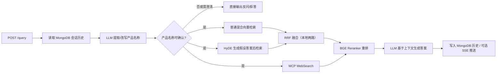

# dataset-rag

面向产品文档的 RAG（检索增强生成）服务。项目提供文档离线入库和在线问答两套 LangGraph 工作流：离线侧将 PDF/Markdown 解析、切分、实体识别和混合向量写入 Milvus；在线侧结合产品名澄清、普通向量检索、HyDE 检索、MCP Web 搜索、RRF 融合和重排生成答案。

## 功能

- PDF 通过 MinerU 异步解析为 Markdown，也支持直接导入 Markdown。
- Markdown 图片可由视觉模型生成摘要，并上传至 MinIO 后替换为对象链接。
- 使用 BGE-M3 同时生成稠密/稀疏向量，支持 Milvus 混合检索。
- 按文档识别产品（实体）名称，查询时先进行实体确认或反问。
- 并行执行普通检索、HyDE 检索和 MCP Web 搜索；前两路经 RRF 融合，Web 结果在重排前合入。
- FastAPI 提供上传、任务状态、问答、SSE 流式响应及会话历史接口。

## 项目结构

```text
dataset-rag/
├── app/
│   ├── clients/                    # Milvus、MinIO、MongoDB、Neo4j 客户端
│   ├── conf/                       # .env 配置映射
│   ├── core/                       # 日志、Prompt 加载、项目路径
│   ├── import_process/             # 离线导入服务与 LangGraph
│   │   ├── api/file_import_service.py
│   │   └── agent/nodes/            # PDF 转 MD、图片处理、切分、向量化、入库
│   ├── query_process/              # 在线查询服务与 LangGraph
│   │   └── agent/nodes/            # 实体确认、检索、RRF、重排、答案生成
│   ├── lm/                         # LLM、BGE Embedding、Reranker 封装
│   └── tool/                       # BGE-M3 / Reranker 模型下载脚本
├── prompts/                        # 实体识别、HyDE、图片摘要、回答等 Prompt
├── tests/                          # pytest 单元测试（纯逻辑，无需外部服务）
├── examples/                       # 两条工作流的图执行示例脚本
├── doc/                            # 示例文档
├── volumes/                        # Docker 中间件持久化数据（运行时生成）
├── docker-compose.yml              # Milvus、MinIO、MongoDB、Neo4j 编排 + 应用服务
├── Dockerfile                      # 应用镜像（多阶段构建，CPU/GPU 可切换）
├── .dockerignore                   # 镜像构建上下文排除规则
├── .env.example                    # 脱敏配置模板
└── pyproject.toml                  # Python 依赖与 uv 配置
```

## 工作流

### 离线导入流程


### 在线检索与回答流程



## 快速开始

提供两种部署方式：

- **方式 A（推荐）**：全部使用 Docker —— 中间件 + 应用服务由 `docker-compose.yml` 一键编排；
- **方式 B**：应用在宿主机用 `uv` 运行，仅中间件用 Docker（适合本地开发调试）。

### 准备环境

要求：Docker Compose（方式 A），或 Python 3.12+（方式 B）；以及可用的 MinerU、OpenAI 兼容 LLM 和（可选）百炼 MCP WebSearch 服务。

```bash
cp .env.example .env
```

Windows PowerShell 可使用：`Copy-Item .env.example .env`

编辑 `.env`，至少填写以下密钥及服务地址：

- `OPENAI_API_KEY=your-openai-api-key`
- `MINERU_API_TOKEN=your-mineru-api-key`
- `NEO4J_PASSWORD=your-neo4j-password`
- `MINIO_ACCESS_KEY`、`MINIO_SECRET_KEY`

> 注意：`docker-compose.yml` 中应用服务会通过 `environment` 覆盖中间件地址（指向 Compose 网络内的服务名），因此 `.env` 中的 `MILVUS_URL` / `MONGO_URL` 等中间件地址仅在方式 B 下生效。

### 方式 A：Docker 部署（推荐，在目标服务器上执行）

> 应用默认面向带 NVIDIA 显卡的 x86_64 Linux 主机（GPU 推理）；构建需在目标机器上执行，本仓库不提供在其他平台构建的保证。

```bash
# 1. 准备本地模型目录（放入 bge-m3 / bge-reranker-large 两个完整模型目录）
mkdir -p models_cache/bge-m3 models_cache/bge-reranker-large
# 将模型文件放入对应目录（含 config.json / model.safetensors 等）

# 2. 构建并启动全部服务（中间件 + 导入服务 + 查询服务）
docker compose up -d --build
docker compose ps
```

- 首次构建会下载 PyTorch（cu128 GPU 版）等依赖，耗时较长；无 GPU 时构建参数 `TORCH_INDEX_URL` 改为 `https://download.pytorch.org/whl/cpu`（`--build-arg` 或 `.env` 中设置）。
- 镜像构建不依赖 ghcr.io（国内网络友好）：builder 阶段基于 `python:3.12-slim` + pip 安装 uv；如 PyPI 下载慢，可传 `--build-arg PIP_INDEX_URL=https://pypi.tuna.tsinghua.edu.cn/simple`（或在 `.env` 中设置 `PIP_INDEX_URL`）。
- 模型目录挂载：宿主机 `${MODELS_CACHE_DIR:-./models_cache}` → 容器 `/models`；容器内 `BGE_M3_PATH=/models/bge-m3`、`BGE_RERANKER_LARGE=/models/bge-reranker-large`。
- 应用默认 GPU 推理（`gpu: true` + `BGE_DEVICE=cuda:0`），需主机安装 NVIDIA 驱动与 Docker GPU 运行时；CPU 部署时按 `docker-compose.yml` 注释移除 `gpu: true` 并修改推理设备为 `cpu`。
- 若不想在 Compose 中构建应用服务，可只起中间件：`docker compose up -d etcd minio standalone mongodb neo4j`。

访问：导入页 `http://<服务器IP>:8000/import.html`，问答页 `http://<服务器IP>:8011/chat.html`。

### 方式 B：宿主机运行（本地开发）

#### 1. 安装依赖

```bash
uv sync
```

#### 2. 启动中间件

```bash
docker compose up -d etcd minio standalone mongodb neo4j
docker compose ps
```

`.env` 请使用本机地址：

```dotenv
MILVUS_URL=http://localhost:19530
MINIO_ENDPOINT=localhost:9000
MONGO_URL=mongodb://localhost:27017
NEO4J_URI=bolt://localhost:7687
```

服务端口：Milvus `19530`（健康检查 `9091`）、MinIO API `9002` / Console `9003`、MongoDB `27017`、Neo4j HTTP `7474` / Bolt `7687`。

> 注意：`docker-compose.yml` 中 `minio` 服务将容器内 `9000` 映射为宿主机 `9002`，因此宿主机运行的应用应使用 `MINIO_ENDPOINT=localhost:9002`（本仓库 Compose 中默认暴露 `9002`，若你自行起 MinIO 请按实际端口配置）。

如不使用 Docker，可分别安装并启动以下中间件：

| 中间件 | 用途 | 安装方式 |
| --- | --- | --- |
| Milvus Standalone | 稠密/稀疏向量与混合检索 | 使用 [Milvus Docker Compose](https://milvus.io/docs/install_standalone-docker.md)，同时启动 etcd 和 MinIO |
| MinIO | 解析图片对象存储 | 使用 [MinIO Server](https://min.io/docs/minio/linux/index.html) 启动服务，并创建 `MINIO_BUCKET_NAME` 指定的桶 |
| MongoDB | 对话历史 | 按 [MongoDB Community Server](https://www.mongodb.com/docs/manual/installation/) 安装，或使用 `docker run -d -p 27017:27017 mongo:8.0` |
| Neo4j | 图数据库连接能力 | 按 [Neo4j Community](https://neo4j.com/docs/operations-manual/current/installation/) 安装，或使用 `docker run -d -p 7474:7474 -p 7687:7687 -e NEO4J_AUTH=neo4j/your-neo4j-password neo4j:5-community` |

> 当前导入主链路写入的是 Milvus；项目保留了 Neo4j 客户端，配置并启动它可供图能力扩展使用。

#### 3. 准备本地模型（可选）

若使用本地 BGE 模型，请先设置 `.env` 中的 `MODELSCOPE_CACHE`，再执行：

```bash
uv run python -m app.tool.download_bgem3
uv run python -m app.tool.download_reranker
```

模型路径需与 `BGE_M3_PATH`、`BGE_RERANKER_LARGE` 相匹配；CPU 环境应保持 `BGE_DEVICE=cpu`、`BGE_FP16=0`。

#### 4. 启动 API

导入服务和查询服务是两个独立进程：

```bash
uv run uvicorn app.import_process.api.file_import_service:app --host 0.0.0.0 --port 8000
uv run uvicorn app.query_process.agent.api.query_service:app --host 0.0.0.0 --port 8011
```

打开 `http://localhost:8000/import.html` 上传文件，打开 `http://localhost:8011/chat.html` 使用问答页面。

## API 概览

| 服务 | 方法与路径 | 说明 |
| --- | --- | --- |
| 导入 | `POST /upload` | `multipart/form-data` 字段为 `files`，批量上传并创建后台导入任务 |
| 导入 | `GET /status/{task_id}` | 查询单个文件的导入状态及已完成节点 |
| 查询 | `POST /query` | 请求体：`{"query":"…","session_id":"可选","is_stream":false}` |
| 查询 | `GET /stream/{session_id}` | 获取 `is_stream=true` 查询的 SSE 结果 |
| 查询 | `GET /history/{session_id}` | 查询会话历史 |
| 查询 | `DELETE /history/{session_id}` | 删除会话历史 |
| 查询 | `GET /health` | 查询服务健康检查 |

非流式查询示例：

```bash
curl -X POST http://localhost:8011/query \
  -H "Content-Type: application/json" \
  -d '{"query":"某产品如何配置？","is_stream":false}'
```

## 配置说明

`.env.example` 是从当前 `.env` 提炼的可提交模板：所有 API Key、访问密钥、数据库密码及原有 IP 均已脱敏。请勿提交真实 `.env`。

主要配置组如下：

- LLM/VLM：`OPENAI_BASE_URL`、`OPENAI_API_KEY`、`LLM_DEFAULT_MODEL`、`VL_MODEL`。
- 向量与重排：`BGE_M3_*`、`BGE_RERANKER_*`、`EMBEDDING_DIM`。
- 数据服务：`MILVUS_*`、`MINIO_*`、`MONGO_*`、`NEO4J_*`。
- 外部解析与搜索：`MINERU_*`、`MCP_DASHSCOPE_*`。
- 运行行为：`MODELSCOPE_OFFLINE`、模型缓存目录、日志级别和保留天数。

## 落地清单与设计文档

- [RAG 项目能力审计与落地清单](RAG_项目能力审计.md)：当前能力盘点、问题优先级、题库对应关系、已决定方案与 TODO。
- [MongoDB 文档版本存储设计](DOCUMENT_VERSION_DESIGN.md)：多租户权限、文档版本、MinIO `object_key`、Milvus 同步、Celery 任务与死信队列的可落地设计。

## 开发与验证

```bash
uv sync          # 安装依赖（含 pytest）
uv run pytest    # 运行纯逻辑单元测试（无需外部服务）
uv run python -m examples.run_import_graph   # 构建并执行导入工作流
uv run python -m examples.run_query_graph    # 构建并执行查询工作流
```

- `pytest` 覆盖切分、RRF 融合、Milvus 转义、稀疏向量归一化等纯函数，不依赖模型与中间件。
- `examples/` 下的两个脚本会构建并执行对应 LangGraph；它们需要已配置的模型、外部 API 和中间件。

## 注意事项

- 当前 API 的 CORS 允许任意来源，生产环境应改为允许的前端域名。
- `docker-compose.yml` 的 MongoDB 未启用认证，仅适用于受控本地开发环境；生产环境请启用账户、密码、网络隔离与持久化备份。
- MinIO Compose 服务的容器内 API 端口为 `9000`，宿主机映射为 `9002`；应用若运行在宿主机，应将 `MINIO_ENDPOINT` 设为 `localhost:9002`。若应用也运行在同一 Compose 网络中，则使用 `minio:9000`。
